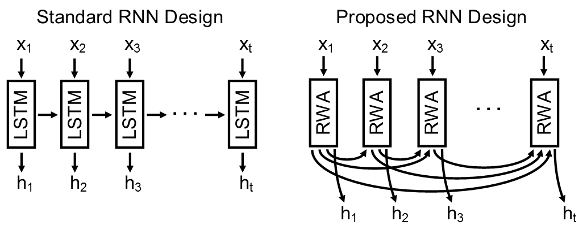

[*Click here for my new approach for classifying sequences and other non-conforming data called Dynamic Kernel Matching*](https://github.com/jostmey/dkm)

## Description

This repository holds the code to a new kind of RNN model for processing sequential data. The model computes a recurrent weighted average (RWA) over every previous processing step. With this approach, the model can form direct connections anywhere along a sequence. This stands in contrast to traditional RNN architectures that only use the previous processing step. A detailed description of the RWA model has been published in a manuscript at [https://arxiv.org/pdf/1703.01253.pdf](https://arxiv.org/pdf/1703.01253.pdf).

Because the RWA can be computed as a running average, it does not need to be completely recomputed with each processing step. The numerator and denominator can be saved from the previous step. Consequently, the model scales like that of other RNN models such as the LSTM model.

In each folder, the RWA model is evaluated on a different task. The performance of the RWA model is compared against a LSTM model. The RWA is found to train considerably faster on most tasks by at least a factor of five. As the sequences become longer, the RWA model scales even better. See the manuscript listed above for the details about each result.

Note: The RWA model has failed to yield competitive results on Natural Language Problems.

## Download

* Download: [zip](https://github.com/jostmey/rwa/zipball/master)
* Git: `git clone https://github.com/jostmey/rwa`

## Requirements

The code is written in Python3. The scripts have been upgraded to run using version 1.0 of TensorFlow.

## Alternative Implementations

 * [RWA model as TensorFlow RNNCell](https://gist.github.com/jostmey/08e7dd67676f14a06b942ca5e8082360) (My implementation)
 * [RWA model as TensorFlow RNNCell](https://github.com/indiejoseph/tf-rda-cell) (Not tested)
 * [RWA model in Keras](https://github.com/keisuke-nakata/rwa) (Reproduced results in paper)
 * [RWA model in Keras](https://gist.github.com/shamatar/55b804cf62b8ee0fa23efdb3ea5a4701) (Not tested)
 * [RWA model in Pytorch](https://github.com/bzcheeseman/pytorch-rwa) (Unstable branch - Work in progess)
 * [RWA model in Pytorch](https://gist.github.com/ririw/4f3a3b3c1828e6d781b624f378890cb0) (Numerically unstable implementation)
 * [RWA model in Go](https://github.com/unixpickle/rwa)

## Acknowledgements

Thanks [Alex Nichol](https://github.com/unixpickle) for correcting the equations for numerical stability.

## Corrections (Changelog)

 - March 17th, 2017: Corrected equations used to rescale the numerator and denominator terms, which is used to avoid overflow and underflow conditions. Results for the RWA model were recomputed.
 - March 26th, 2017: Corrected a bug specific to the code for loading the permuted MNIST task. Results for permuted MNIST task were recomputed.
 - April 3rd, 2017: Corrected bug in the LSTM model. This bug affected all the results except for the copy problem. Results for the LSTM model were recomputed. No significant changes in performance were observed.

